# Android-Tutorial mit Java

Dieser Kurs richtet sich an alle, die Android mit Java lernen möchten und bereits irgendeine objektorientierte Programmiersprache beherrschen. Zu allen Beispielen finden Sie ein Video unter https://www.youtube.com/playlist?list=PLosiZFS_rnz7fUOCbmzEF7gE0wYbVreyO Am Ende dieses Kurses können Sie beipsielsweise eine App wie [motiweightme](https://www.youtube.com/watch?v=4q60uB5iCSs) erstellen -- diese App verwendet nur die hier vorgestellten Technologien, mit ihr habe ich mir die Inhalte angeeignet ;-)

## Übersicht - in alphabetischer Reihenfolge

| Beispiel | Was  | Screenshot | Screenshot |
| :---------: | ---------------------------------------------- | :----------: | :----------: |
| ActivityCommunication | Navigation zwischen Activities inkl. Parameterübergabe und Rückgabewert | 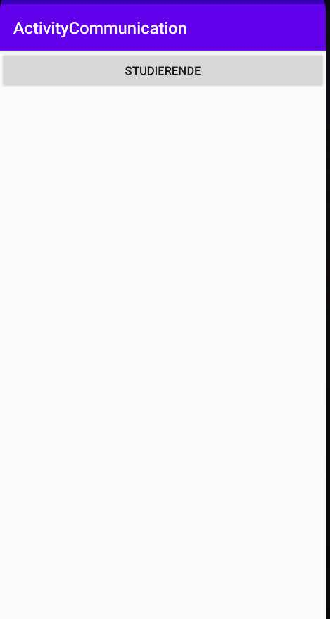 | 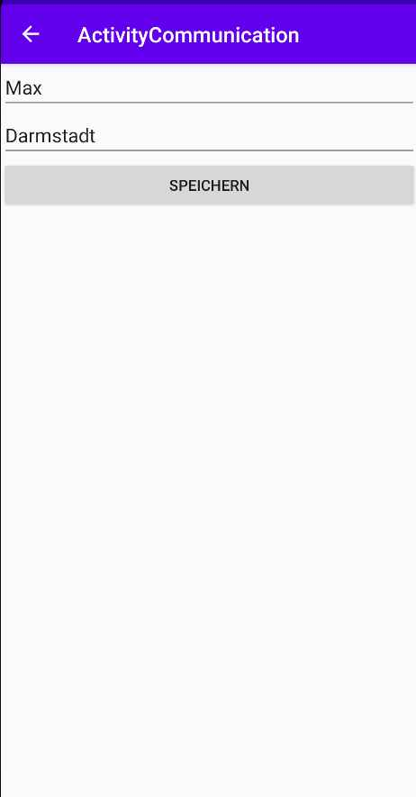 |
| BMI | erste App mit einfacher Validierung, Integer.parseInt und String.Format | 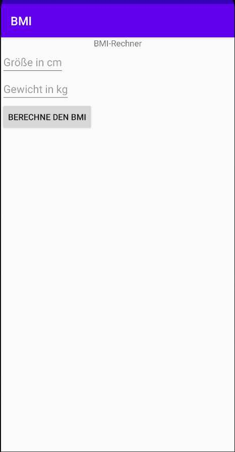 |
| DemoArchitectureComponents | Kotlin: ViewModel, Fragment, BottomNavigation, RecyclerView, ... | 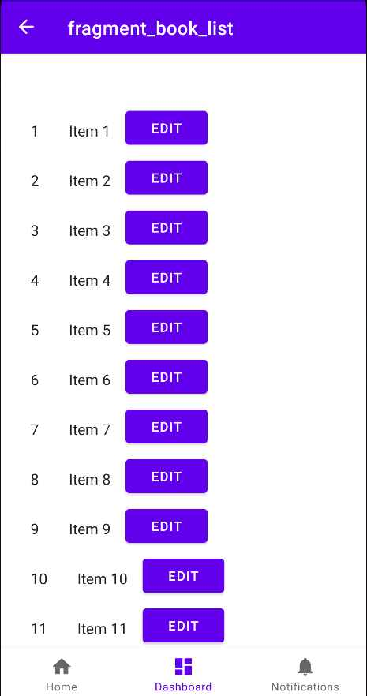 |
| DemoBottomNavigation | Eigenimplementation einer BottomNavigation ohne Fragments | 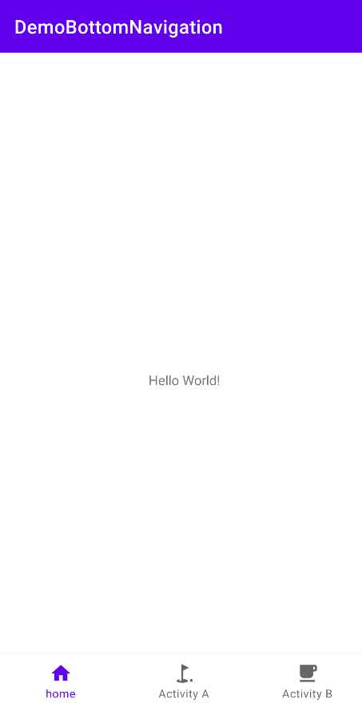 |
| DemoDialogs | Toast, Snackbar, AlertDialog, NumberPicker, DatePicker | 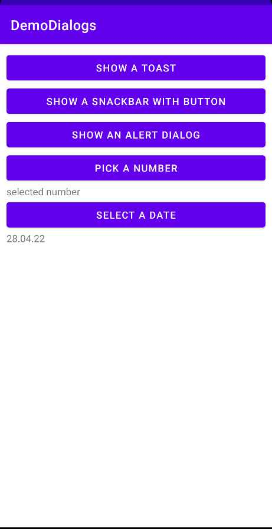 | 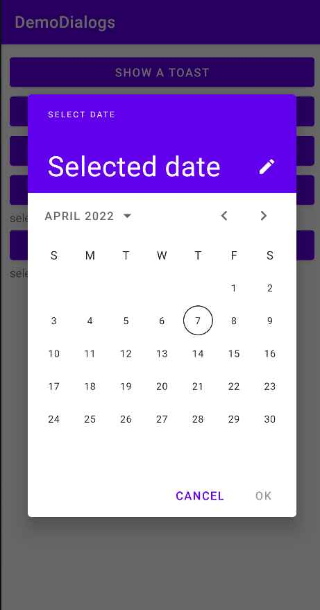 |
| DemoFirebase | Einfacher Gruppenchat: Firebase, anononymous login, Echtzeitänderungen, Formatierung von Sprechblasen, RecyclerView | 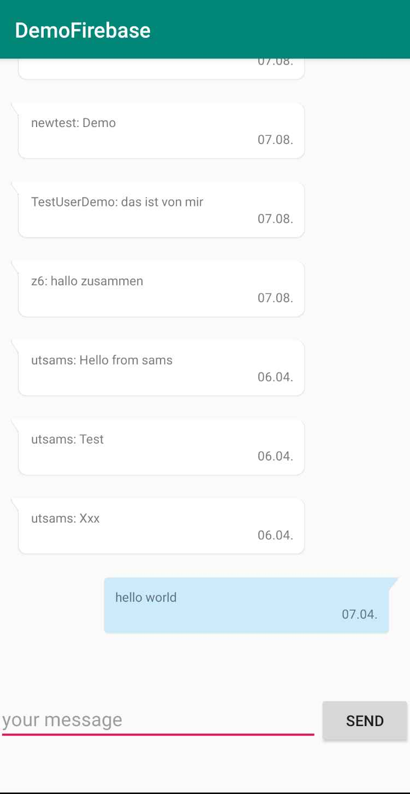 |
| DemoRecyclerView | RecyclerView mit onClick und glide zum Laden der Internetbilder |  |
| DemoRessources | Anzeige von Bildern und Icons, Definition mit Schriftgrößen und Farben | 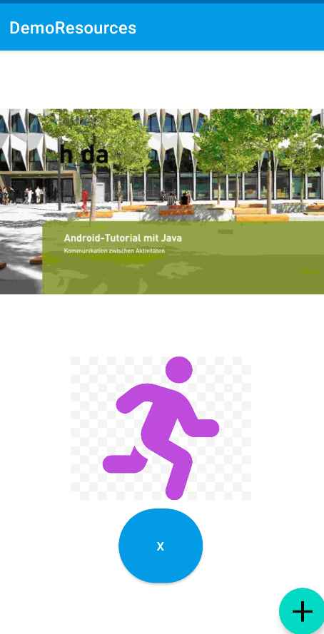 |
| DemoRest | Abfrage einer API mit Volley; asynchron mit Thread und Workmanager (mit cancel und circular progress); JSON |  |
| DemoRoom | SQL-DB-Zugriff mit ORM-Mapper Room, und Spinner für Filterfunktion, Bilder werden mit glide geladen, Auswahl von Bild aus Galerie, Recyclerview zur Anzeige der Ergebnisse | 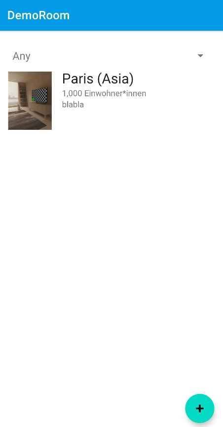 | 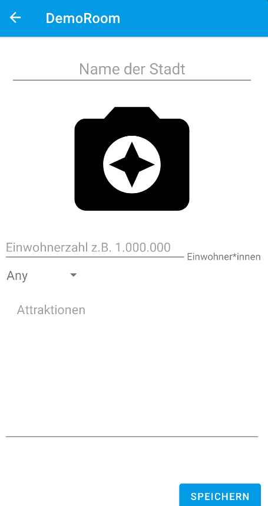 |
| DemoSettings | einfacher SettingsDialog  | 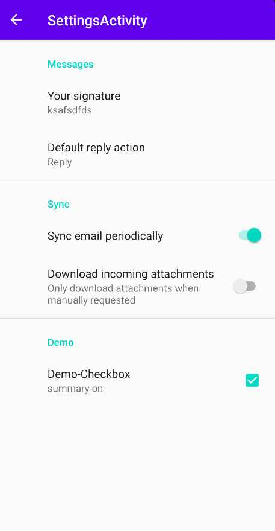 |
| DemoToolbarNavigation | Verwwendung einer Toolbar/Navigation Drawer (ohne Fragments) und OptionsMenu | 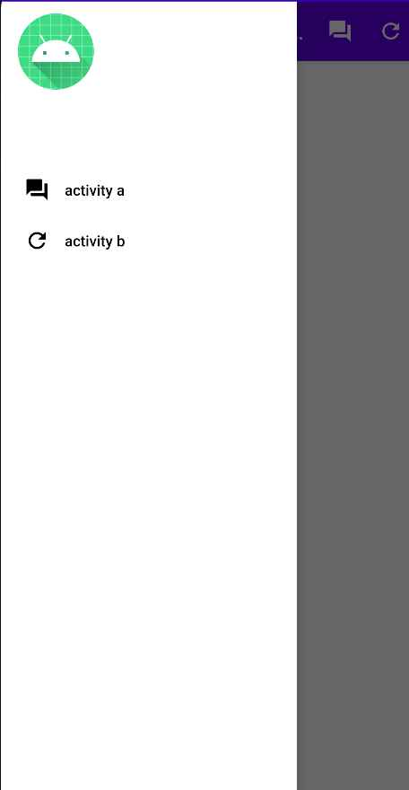 |
| LayoutDemos | einfaches ConstraintLayout  | 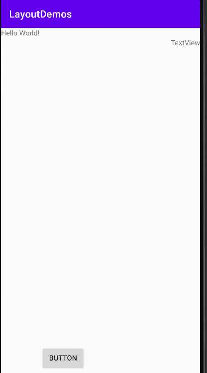 |

- :

# Disclaimer

Sie können in diesem Kurs die Basics der Android-Entwicklung verstehen. Um die Fehlersuche zu vereinfachen, gehe ich weder auf Fragments noch auf Viewmodels ein -- beides gehört zum Standard einer guten App. Wenn Sie mit Android vertraut sind, sollten Sie sich daher unbedingt mit diesen Konzepten vertraut machen.
